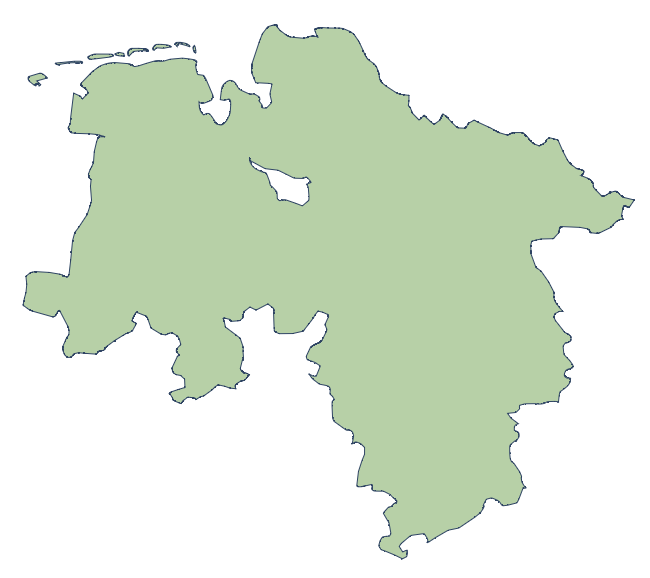

### Auswertung der Ergebnisse

#### *Ziel der Aufgabe:*
- Ermitteln der Fläche der einzelnen Bundesländer
- Ermitteln in welchem Bundesland, angegebene Städte liegen

#### *Ansatz:*

Zunächst werden die Flächeninhalte der einzelnen Bundesländer mithilfe der Funktion 
`extractBundesland` berechnet. In dieser Funktion werden zunächst die Koordinaten 
(für jedes Bundesland) aus der angegebenen SVG-Datei extrahiert und in einem Polygon 
gespeichert. Nach der Verarbeitung aller Koordinatenpunkte werden diese in einem Bundesland-
Objekt gespeichert.
```Python
# Bundesland Objekt
type Bundesland struct {
    id          string
    coordinates [][]Point
    area        float64
}
```
Der Flächeninhalt `area` eines Bundesland-Objekts wird initial auf `0.0` gesetzt. 
Um den Flächeninhalt zu berechnen, muss zunächst überprüft werden, ob es sich um 
eine Insel oder ein Loch handelt. Hierfür wird die Funktion ` checkIfIsland` 
verwendet. Die Überprüfung muss erfolgen, um sicherzustellen, dass beispielsweise 
in Niedersachsen, der Flächeninhalt von Bremen nicht mit berechnet wird. Bremen 
soll in in diesem Fall als „Loch“ angenommen werden (siehe Abbildung). Die 
Überprüfung erfolgt, indem eine zufällige Variable erzeugt wird, und durch alle 
Polygone iteriert wird, welche das Bundesland repräsentieren. Falls das gegebene 
Polygon und das aktuelle Polygon in der Schleife identisch sind, wird die Schleife 
übersprungen, ansonsten wird das aktuelle Polygon der Variable `coordinates` 
hinzugefügt. In `coordinates` werden vorübergehend für jedes Polygon die Koordinaten 
gespeichert. Anschließend wird geprüft, ob die zufällige Variable, innerhalb den 
temporären Koordinaten liegt. Hierfür wird die Hilfsfunktion `isCoordinateInFederalState` 
verwendet. Falls der zufällige Punkt in keinem Polygon liegt, wird `true` zurückgeliefert, 
um anzuzeigen, dass das Polygon eine Insel ist.



Die Hilfsfunktion `isCoordinateInFederalState` wird des Weiteren verwendet, um zu überprüfen, 
in welchem Bundesland eine Stadt liegt. Der Funktion wird hierfür eine Koordinate und eine 
Liste von Polygonen übergeben. Zunächst wird die Variable `intersection` initialisiert, um die 
Anzahl der Schnittpunkte zwischen dem gegebenen Punkt und den Kanten des Polygons zu zählen. 
Anschließend wird eine Schleife gestartet, um durch jedes Polygon in der Liste zu iterieren. 
Für jede Kante soll überprüft werden, ob eine Schnittkante zwischen dem übergebenen Punkt gibt. 
Falls ein Schnittpunkt gefunden wird, wird die Anzahl von `intersections` erhöht. Ist am Ende 
die Anzahl der Schnittpunkte ungerade, liegt die übergebene Koordinate im Polygon, und es wird 
`true` zurückgegeben.

#### *Ergebnisse:*
Vom größten Bundesland absteigend sortierend sind die Ergebnisse in folgender Tabelle dargestellt:

| Bundesland                | Flächeninhalt  | Prozentualer Anteil |
|---------------------------|----------------|---------------------|
| Bayern                    | 60026.125      | 19.73               |
| Niedersachsen             | 40633.469      | 13.36               |
| Baden-Württemberg         | 30522.306      | 10.03               |
| Nordrhein-Westfalen       | 28966.399      | 9.52                |
| Brandenburg               | 25275.919      | 8.31                |
| Mecklenburg-Vorpommern    | 19658.779      | 6.46                |
| Hessen                    | 17977.527      | 5.91                |
| Sachsen-Anhalt            | 17450.549      | 5.74                |
| Rheinland-Pfalz           | 16913.581      | 5.56                |
| Sachsen                   | 15667.910      | 5.15                |
| Thüringen                 | 13724.631      | 4.51                |
| Schleswig-Holstein        | 13456.436      | 4.42                |
| Saarland                  | 2179.764       | 0.72                |
| Berlin                    | 766.233        | 0.25                |
| Hamburg                   | 633.325        | 0.21                |
| Bremen                    | 340.931        | 0.11                |
| Flächeninhalt Deutschland | 304193.886     |   

Die in der SVG-Datei übergebenen Städte liegen in den folgenden Bundesländern:
- Die Stadt Magdeburg ist in Sachsen-Anhalt
- Die Stadt Erfurt ist in Thüringen
- Die Stadt Dresden ist in Sachsen
- Die Stadt Schwerin ist in Mecklenburg-Vorpommern
- Die Stadt München ist in Bayern
- Die Stadt Mainz ist in Rheinland-Pfalz
- Die Stadt Düsseldorf ist in Nordrhein-Westfalen
- Die Stadt Hannover ist in Niedersachsen
- Die Stadt Stuttgart ist in Baden__x26__Württemberg
- Die Stadt Wiesbaden ist in Hessen
- Die Stadt Bremen ist in Bremen
- Die Stadt Kiel ist in Schleswig-Holstein
- Die Stadt Potsdam ist in Brandenburg
- Die Stadt Berlin ist in Berlin
- Die Stadt Saarbrücken ist in Saarland
- Die Stadt Hamburg ist in Hamburg


